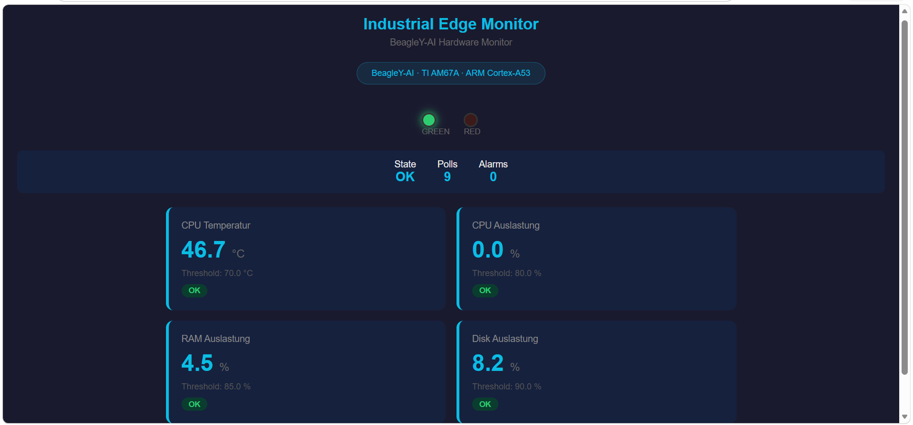

# Industrial Edge Monitor (BeagleY)

Real-time hardware monitoring system running on BeagleY with a custom Yocto Linux image. Reads real CPU temperature, system metrics, controls onboard LEDs, and publishes data via MQTT.

## What it does

```text
                 BeagleY Hardware

+----------------+
| Real Sensors   |
| (SoC Temp,     |
| CPU Usage, RAM)|
+----------------+
        |
        v
+----------------+
| Edge Monitor   |
|      (C)       |
+----------------+
        |
        +------------------> MQTT Broker
        |
        +------------------> REST API
        |                           |
        v                           v
+----------------+        +----------------+
| Onboard LEDs   |        | Dashboard      |
| (Green / Red)  |        |    (Flask)     |
+----------------+        +----------------+
```

## Real Hardware Sensors

| Sensor | Source | Threshold |
|--------|--------|-----------|
| CPU Temperature | `/sys/class/thermal/thermal_zone0/temp` | > 70°C |
| CPU Usage | `/proc/stat` | > 80% |
| RAM Usage | `/proc/meminfo` | > 85% |
| Disk Usage | `statvfs("/")` | > 90% |
| Load Average | `/proc/loadavg` | — |

## Difference from QEMU Project

| | [QEMU Project](https://github.com/meka23749/yocto-industrial-bridge) | This Project |
|---|---|---|
| Hardware | Emulated ARM64 | Real BeagleY-AI |
| Temperature | Simulated (rand) | Real SoC thermal sensor |
| CPU/RAM | Simulated | Real /proc/stat, /proc/meminfo |
| LEDs | printf only | Real onboard LEDs via sysfs |
| Network | Virtual | Real WiFi/Ethernet |

## Tech Stack

- **Board**: BeagleY-AI (TI AM67A, ARM Cortex-A53, 4GB RAM)
- **OS**: Custom Yocto Linux (Scarthgap)
- **Edge Monitor**: C (real sensor reading, LED control, MQTT publishing)
- **Dashboard**: Python Flask (real-time hardware metrics)
- **Build**: Dockerized Yocto build environment
- **CI/CD**: GitHub Actions

## Project Structure

## Project Structure

```text
beagley-edge-monitor/
├── meta-beagley-monitor/              # Custom Yocto layer
│   ├── conf/
│   │   └── layer.conf
│   ├── recipes-app/
│   │   ├── edge-monitor/             # C application
│   │   │   ├── edge-monitor_1.0.bb
│   │   │   └── files/
│   │   │       ├── edge_monitor.c
│   │   │       └── Makefile
│   │   └── web-dashboard/            # Flask dashboard
│   │       └── files/
│   │           └── app.py
│   └── recipes-core/
│       └── images/
│           └── edge-monitor-image.bb
├── docker/
│   └── Dockerfile
├── scripts/
│   └── docker-build.sh
├── docs/                             # Screenshots
└── .github/
    └── workflows/
        └── build.yml
```

## Quick Start

### Test locally (without Yocto)
```bash
# Edge Monitor (reads real system metrics)
cd meta-beagley-monitor/recipes-app/edge-monitor/files
make && ./edge-monitor 5

# Web Dashboard (real-time UI)
cd meta-beagley-monitor/recipes-app/web-dashboard/files
pip install flask
python3 app.py
# Open: http://localhost:5000
```

### Build with Docker
```bash
docker build -t beagley-monitor -f docker/Dockerfile .
docker run -it beagley-monitor
```

## Screenshots

### Edge Monitor (real hardware readings)


### Web Dashboard (real-time)


## API Endpoints

| Endpoint | Description |
|----------|-------------|
| `GET /` | Web dashboard with real-time metrics |
| `GET /api/sensors` | JSON sensor data |
| `GET /api/health` | Health check |

## Requirements & Traceability

- [Requirements Specification](docs/beagley_01_Requirements.md) 
- [Traceability Matrix](docs/beagley_02_Traceability_Matrix.md) 


## Author

**Steve Meka**

- Website: [stevkmef.com](https://www.stevkmef.com)
- GitHub: [meka23749](https://github.com/meka23749)
